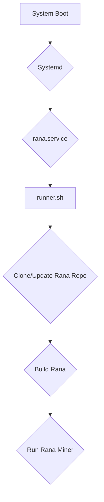

# High-Level Design Document: Rana Service

## 1. System Overview

The Rana Service is a background process responsible for managing the `rana` Nostr public key miner. Its primary function is to ensure that the `rana` mining process is always running with the lowest possible system priority, minimizing its impact on other applications.

The service will be designed to be resilient and autonomous, with the following key features:

- **Automatic Startup**: The service will start automatically on system boot.
- **Process Supervision**: It will monitor the `rana` mining process and restart it if it fails.
- **Configuration Management**: The service will be configurable to specify the target `npub` vanity prefix.
- **Resource Management**: It will use `nice` to ensure the mining process runs at the lowest priority.

## 2. Component Architecture

The Rana Service will consist of the following components:

- **Service Manager**: A systemd service unit that manages the lifecycle of the Rana Service.
- **Runner Script**: A shell script that handles the logic of cloning, building, and running the `rana` miner.

## 3. Data Flow

1.  On system boot, `systemd` starts the `rana.service`.
2.  The `rana.service` executes the `runner.sh` script.
3.  The `runner.sh` script checks if the `rana` repository exists in the user's home directory.
    - If it doesn't exist, it clones the repository.
    - If it exists, it pulls the latest changes.
4.  The script then builds the `rana` binary using `cargo`.
5.  Finally, it starts the `rana` miner with the specified vanity prefix (`meshmate`) and the lowest priority using `nice`.

## 4. Future Extensibility

- **Dynamic Configuration**: The vanity prefix could be made configurable through a separate configuration file.
- **Log Management**: The service could be extended to manage log files for the `rana` miner.
- **API for Status Monitoring**: An API could be exposed to check the status of the mining process.